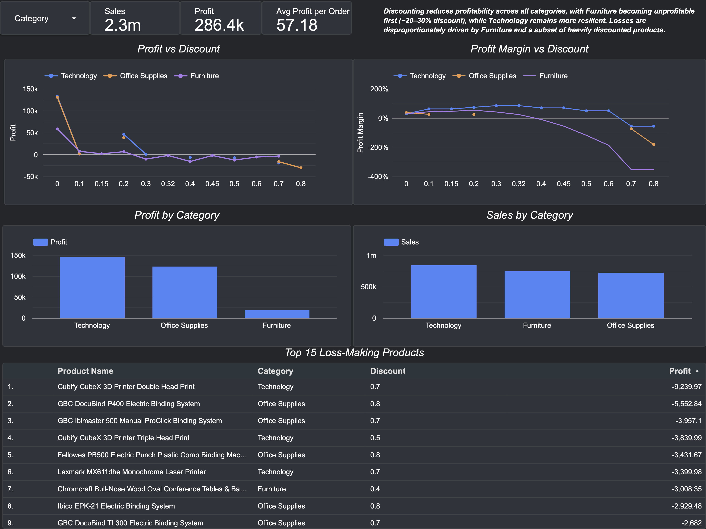

## Retail Sales Analytics — Discount Impact Analysis

### Project Overview

This project analyses how discounting strategies impact sales and profitability across different product categories using real-world retail data.

The goal is to determine whether discounts drive sustainable growth or erode profit margins.

⸻

### Tools & Technologies
	•	Python (Pandas, Matplotlib)
	•	Jupyter Notebook
	•	Google Looker Studio (Dashboard)
	•	Excel (Pivot Tables for initial exploration)

⸻

### Dataset
	•	Sample Superstore dataset
	•	Includes: Sales, Profit, Discount, Category, Product, Region

⸻

### Key Analysis Performed

1. Profit vs Discount
	•	Grouped profit by discount levels
	•	Identified break-even point

2. Category-Level Analysis
	•	Compared Furniture, Technology, Office Supplies
	•	Identified which category becomes unprofitable first

3. Profit per Order (Average Profit)
	•	Removed volume bias
	•	Revealed true impact of discounting

4. Revenue vs Profit Comparison
	•	Demonstrated that increased sales do not guarantee higher profitability

5. Dashboard (Looker Studio)
	•	Interactive filtering by category
	•	Visual breakdown of profit and margin trends

6. Excel Analysis
	•	Initial exploration using Pivot Tables
	•	Identified early trends in category performance and seasonality

⸻

### Key Insights
	•	Profit declines sharply as discounts increase
	•	Profit turns negative around 25–30% discount levels
	•	Furniture becomes unprofitable first (~20% discount)
	•	Technology remains the most resilient category
	•	Discounts may increase sales temporarily but fail to improve profitability

⸻

### Dashboard Live
[View Dashboard](https://lookerstudio.google.com/s/kLDKoso681Y)

### Preview 

### Business Recommendations
	•	Avoid aggressive discounting above 20–25%
	•	Re-evaluate pricing strategy for Furniture products
	•	Focus on high-margin Technology products for profitability

⸻

### Key Learning

This project highlights that revenue growth does not necessarily translate to profitability, and emphasises the importance of analysing profit and margin when evaluating business performance
